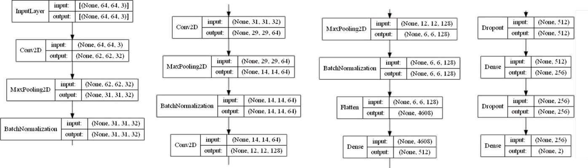
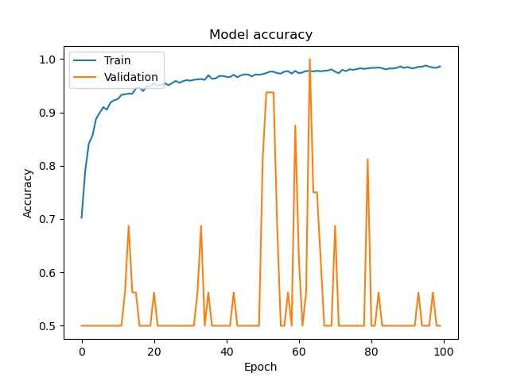
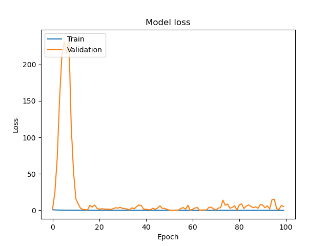
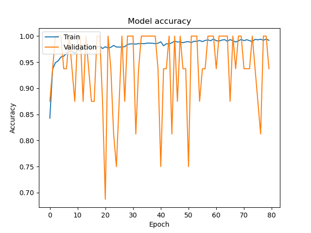
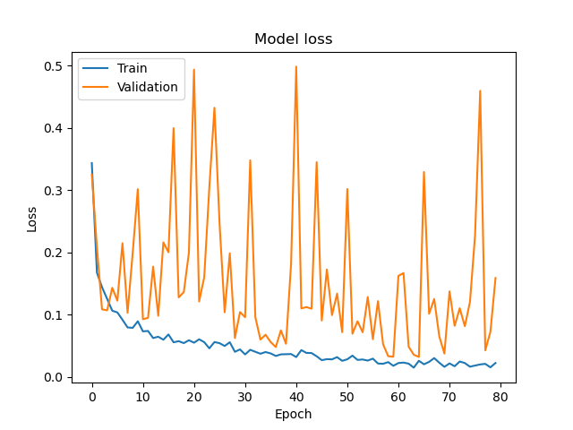
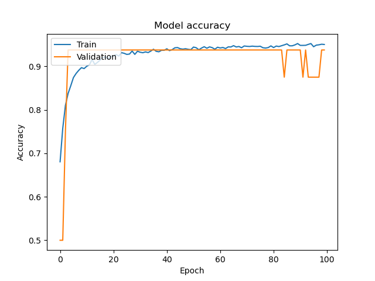
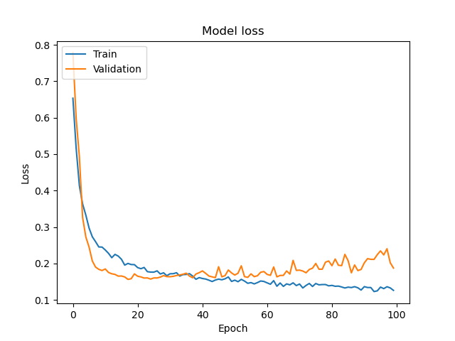

# Project: Pneumonia Classification

This project leverages deep learning to classify pneumonia from chest X-ray images. The goal is to develop, train, and evaluate various models to achieve high accuracy and robustness.

---

## Table of Contents
1. [Introduction](#introduction)
2. [Dataset](#dataset)
3. [Model Propositions](#model-propositions)
    - [Custom Model Developed from Scratch](#custom-model-developed-from-scratch)
    - [ResNet Architecture](#resnet-architecture)
    - [VGG16 Architectures](#vgg16-architectures)
4. [Model Training](#model-training)
5. [Performance Evaluation](#performance-evaluation)
6. [Model Comparisons](#model-comparisons)
7. [Results](#results)
8. [Conclusion](#conclusion)

---

## Introduction
Pneumonia is a severe respiratory infection that can be detected using chest X-ray images. This project aims to classify pneumonia using advanced deep learning techniques, comparing custom-built and pre-trained model architectures.

---

## Dataset
The dataset contains labeled chest X-ray images categorized into pneumonia-positive and pneumonia-negative classes. 

---

## Model Propositions

### Custom Model Developed from Scratch
- **Architecture Overview:**  
    
  The custom model was designed with layers optimized for processing X-ray images to detect pneumonia effectively.

### ResNet Architecture
- **Architecture Overview:**  
    
  The ResNet architecture leverages residual connections to improve learning efficiency and mitigate vanishing gradient issues.

### VGG16 Architectures
Three models based on VGG16 architecture were implemented:  
1. **VGG16 with RMSprop Optimizer**  
2. **VGG16 with Adam Optimizer**  
3. **VGG16 with Adam Optimizer and Frozen CNN Layers**  
     

---

## Model Training
All models were trained using the same dataset split to ensure fair comparisons. Hyperparameters, optimizers, and training strategies varied depending on the architecture.

---

## Performance Evaluation
The evaluation metrics include accuracy and loss for both training and validation datasets. Below are the results for each model:

### Custom Model
- Accuracy and loss graphs are available in the project files.

### ResNet
- **Accuracy:**  
    
- **Loss:**  
    

### VGG16
#### VGG16 with RMSprop
- Accuracy and loss graphs are available in the project files.

#### VGG16 with Adam
- **Accuracy:**  
    
- **Loss:**  
    

#### VGG16 with Adam (Frozen CNN Layers)
- **Accuracy:**  
    
- **Loss:**  
    

---

## Model Comparisons
The comparison between models is based on:
1. Accuracy: 
   - Custom Model: TBD
   - ResNet: TBD
   - VGG16 (RMSprop): TBD
   - VGG16 (Adam): TBD
   - VGG16 (Adam with Frozen Layers): TBD
2. Loss: Detailed evaluation in the results section.

---

## Results
A summary table of the results for all models can be found in the project report.  
Visual comparisons indicate the strengths and weaknesses of each model, emphasizing trade-offs in accuracy and computational efficiency.

---

## Conclusion
This project highlights the potential of deep learning in medical imaging. While pre-trained architectures like ResNet and VGG16 performed well, the custom model demonstrated competitive performance, showcasing the effectiveness of designing task-specific architectures.

---

### Notes
- For more detailed analysis, refer to the training notebooks and evaluation scripts.
- All images and training logs are included in the project directory.
## Project by

